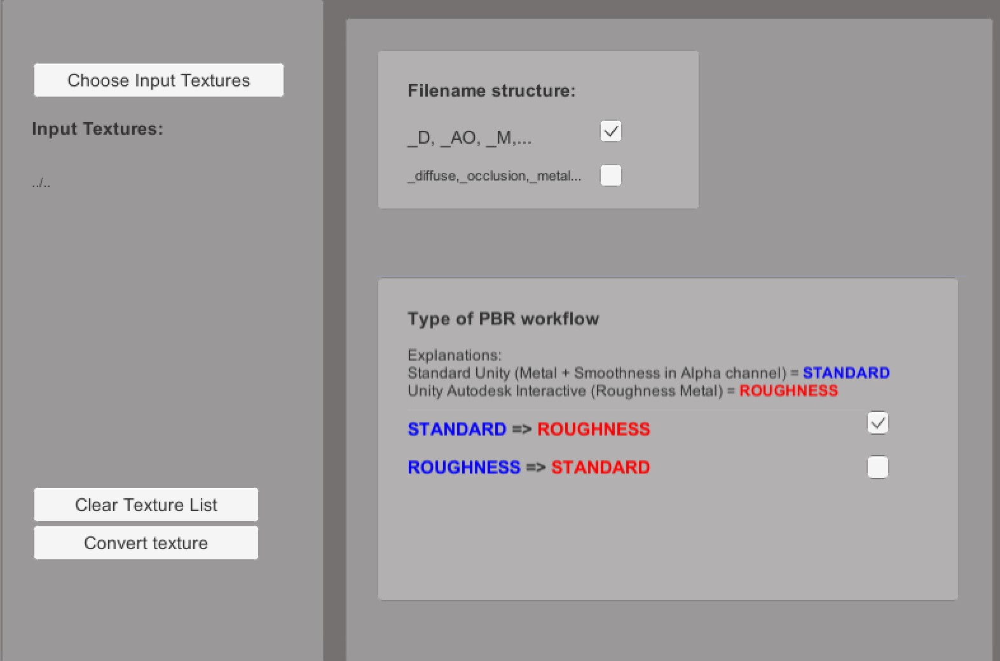
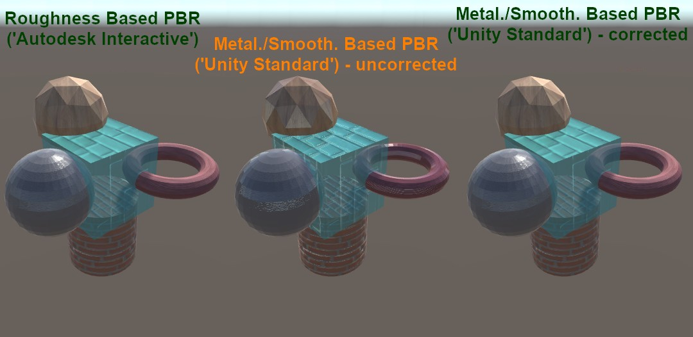
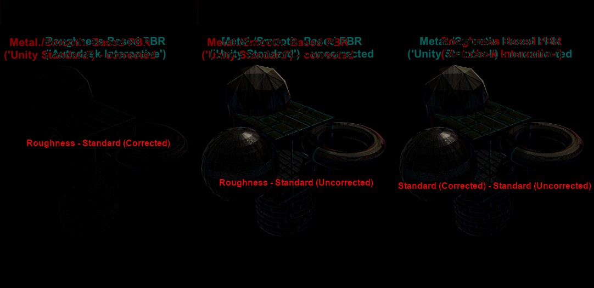

# Roughness <=> Standard texture converter V1.0
Unity project for a tool that convert PBR textures between Roughness and Standard for Unity shaders

## System Requirements
Unity 2018.3 or more (the script should work on lower version, but the minimum version I used was that one)

The app has been tested on OSX and Windows 10.

# Quick Usage
On application start, you can **select** the list of texture you want to convert with the button on the left.

When all textures have been selected, you can of course **clear** the list, to start a new selection if needed.

When the textures have been selected, you should select the **naming** scheme of the textures. The names used in the industry are usually suffixes, like '-diffuse', or '_normal', or '_D', '_N'...
For the moment, only 'full names' for the suffixes are used.

You then choose the order you will follow for the conversion. You can go from **'Standard'** to **'Roughness'** or from **'Roughness'** to **'Standard'**. (For the moment, **only Roughness to Standard** is available.

## Purpose
The PBR rendering mode is available in Unity via the Specular/Glossiness mode or the Roughness mode.
The textures built for one mode aren't direcly usable in the other mode.
This tool/project is made to help you automatically convert the textures from one mode to the other.

## How it works
### Algorithm
In Unity, the Standard shader is asking for a **Metallicity** map, with the **Smoothness** being stored as the **Alpha channel of the Metal map**.

The **Smoothness** is equivalent to the inverted **Roughness**. 

That means that to go from **Roughness** to **Standard**, you take the **Roughness** map, keep one channel, invert it, and store it into the alpha channel of the metal map.

## Test scene
A test is available in the project, to give a comparison between the three shaders.
The (ugly) test model was created in Blender, and exported as FBX.
The textures were made to use the Roughness mode.
The model on the left is using the **'Roughness'** shader, also called **'Autodesk Interactive'** in Unity.
The model in the center is using the **'Standard'** shader, while direcly using the textures of the **'Roughness'** mode.
The model on the right is using the **'Standard'** shader, while using the textures of the **'Roughness'** mode, that have been converted to **'Standard'**.
You can visually check that the model on the left is similar to the model on the right.
By substracting the images (left minus center, left minus right and center minus right), you can have the visual proof of the effective difference between the images.

## The Code
The code is built around two classes: **TextureConverter** and **TextureConverterGUI**.

# Limitations
For the moment, the conversion is only possible from Roughness to Standard. The other way, Standard to Roughness, isn't implemented yet.

# TODO
Change the ugly GUI.
Implement **Standard to Roughness**.
Implement the 'short naming' convention.

# Dependencies
The project is using OpenCV as an asset, to do the texture conversion.
The asset is OpenCV plus Unity : https://assetstore.unity.com/packages/tools/integration/opencv-plus-unity-85928

The project is using StandAloneFileBrowser to access the native file browser : https://github.com/gkngkc/UnityStandaloneFileBrowser

# License
The C# code of the app and the Unity project is MIT licensed : https://github.com/github-for-unity/Unity/blob/master/LICENSE